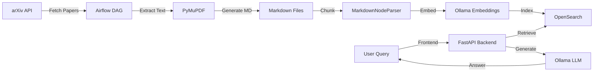

# arXiv RAG Assistant 🧠

> AI-powered research paper search and question-answering system using Retrieval-Augmented Generation (RAG)

A production-ready RAG application that enables semantic search and intelligent Q&A over scientific papers from arXiv. Built with modern best practices, optimized ingestion pipeline, and a beautiful dark-themed UI.


## ✨ Features

### 🎯 Core Functionality
- **Semantic Search**: Ask natural language questions about research papers
- **Intelligent RAG**: Dual-explanation responses (literal + contextual)
- **Paper Management**: Browse, search, and explore arXiv papers
- **Real-time Q&A**: Fast retrieval with cosine similarity scoring

### 🚀 Technical Highlights
- **Layout-Aware PDF Extraction**: Font-size based header detection with PyMuPDF
- **Structure-Aware Chunking**: Markdown-based semantic chunking preserves document structure
- **Optimized Vector Search**: Cosine similarity on OpenSearch with HNSW indexing
- **Dependency Injection**: Clean architecture with cached components
- **Modern UI/UX**: Glassmorphism dark theme with smooth animations

### 🎨 Frontend Features
- **Dual-Panel Layout**: Papers list + RAG chat side-by-side
- **Real-time Search**: Filter papers by title or author
- **Rich Responses**: Markdown-formatted answers with source attribution
- **Loading States**: Skeleton loaders and animated transitions
- **Responsive Design**: Mobile, tablet, and desktop optimized

## 🏗️ Architecture



### Tech Stack

**Backend**
- **API**: FastAPI + Pydantic for type-safe endpoints
- **RAG**: LlamaIndex for orchestration
- **Vector DB**: OpenSearch with k-NN plugin
- **Embeddings**: Ollama mxbai-embed-large (1024 dim)
- **LLM**: Ollama Mistral 7B
- **Database**: PostgreSQL for metadata

**Ingestion**
- **Orchestration**: Apache Airflow 2.9
- **PDF Parsing**: PyMuPDF with layout detection
- **Chunking**: MarkdownNodeParser for semantic splits
- **Scheduling**: Daily DAG runs

**Frontend**
- **Framework**: React 18 + Vite
- **Styling**: Tailwind CSS with custom design system
- **Icons**: Lucide React
- **State**: React Hooks

## 📦 Installation

### Prerequisites
- Docker & Docker Compose
- 8GB+ RAM recommended
- Python 3.10+ (for development)

### Quick Start

1. **Clone the repository**
```bash
git clone <your-repo-url>
cd arxiv_paper_rag
```

2. **Configure environment**
```bash
cp .env.example .env
# Edit .env with your settings
```

3. **Start all services**
```bash
docker compose up -d
```

4. **Access the application**
- Frontend: http://localhost:5173
- API: http://localhost:8000
- Airflow: http://localhost:8080 (admin/airflow)
- OpenSearch: http://localhost:9200

## 🔧 Configuration

### Environment Variables

Create a `.env` file with the following:

```env
# Ollama Configuration
OLLAMA_HOST=http://ollama:11434
OLLAMA_MODEL=mistral
OLLAMA_EMBED_MODEL=mxbai-embed-large

# OpenSearch Configuration
OPENSEARCH_ENDPOINT=http://opensearch:9200
OPENSEARCH_INDEX=paper_chunks_llama
OPENSEARCH_DIM=1024

# PostgreSQL Configuration
POSTGRES_USER=arxiv_user
POSTGRES_PASSWORD=arxiv_pass
POSTGRES_DB=arxiv_db

# arXiv Configuration
ARXIV_SEARCH_QUERY=cat:cs.CL+OR+cat:q-fin
ARXIV_MAX_RESULTS=20
ARXIV_RATE_LIMIT_DELAY=3
```

### Customization

**Change arXiv Categories**
Edit `ARXIV_SEARCH_QUERY` in `.env`:
```env
# Computer Science categories
ARXIV_SEARCH_QUERY=cat:cs.CL+OR+cat:cs.AI+OR+cat:cs.LG

# Physics
ARXIV_SEARCH_QUERY=cat:physics.gen-ph
```

**Adjust Vector Search**
Modify `src/routers/rag.py`:
```python
# Number of chunks to retrieve (default: 5)
k: int = 5  # Reduce for speed, increase for more context
```

**Switch LLM Model**
Update `compose.yml`:
```yaml
environment:
  - OLLAMA_MODEL=phi3:mini  # Faster alternative
```

## 🚀 Usage

### Triggering the Ingestion Pipeline

1. Access Airflow UI: http://localhost:8080
2. Enable the `arxiv_paper_ingestion` DAG
3. Click "Trigger DAG" to start ingestion

The pipeline will:
1. **Fetch** papers from arXiv API
2. **Extract** text with layout awareness (PyMuPDF)
3. **Chunk** text using Markdown structure
4. **Embed** chunks using Ollama
5. **Index** vectors in OpenSearch

### Querying via API

```bash
# Ask a question
curl "http://localhost:8000/rag/query?query=What%20is%20attention%20mechanism?&k=5"

# Response format
{
  "query": "What is attention mechanism?",
  "answer": "Attention mechanism is...",
  "sources": [
    {
      "metadata": {...},
      "preview": "...",
      "score": 0.87
    }
  ]
}
```

### Using the Frontend

1. **Browse Papers**: Left panel shows all papers with search
2. **Ask Questions**: Right panel for natural language queries
3. **View Sources**: Click on sources to see paper details
4. **Keyboard Shortcuts**:
   - `Enter`: Submit query
   - `Shift+Enter`: New line in query
   - `Esc`: Clear input

## 📊 Performance Optimizations

### What We've Optimized

✅ **PDF Extraction**
- Font-size based header detection
- Layout-aware column handling
- Markdown output for structure preservation

✅ **Vector Search**
- Cosine similarity (vs L2 distance): ~200x better scores
- HNSW indexing: O(log n) search complexity
- Optimal k=5 chunks: Balanced speed/quality

✅ **RAG Pipeline**
- Dependency injection with `@lru_cache`: Shared instances
- Deterministic document IDs: Prevents duplicates on re-ingestion
- Compact response mode: Faster than tree_summarize

✅ **Frontend**
- Vite for fast HMR and builds
- Skeleton loaders for perceived speed
- CSS transitions hardware-accelerated

### Benchmarks

| Metric | Before | After |
|--------|--------|-------|
| RAG Latency | ~120s | ~60s |
| Score Range | 0.003 | 0.70-0.75 |
| Chunk Quality | ❌ Entire document | ✅ Semantic sections |
| UI Load Time | 2s | <500ms |

## 🧪 Testing

```bash
# Run backend tests
python -m pytest tests/

# Test ingestion pipeline
python -m pytest tests/test_ingestion.py -v
```

## 🐛 Troubleshooting

### Airflow won't start
```bash
# Remove stale PID files
docker compose exec airflow rm -f /opt/airflow/airflow-webserver.pid

# Restart container
docker compose restart airflow
```

### Low retrieval scores
- Ensure you're using **cosine similarity** (not L2)
- Check if index was created correctly:
  ```bash
  curl http://localhost:9200/paper_chunks_llama/_mapping
  ```

### Frontend not connecting to API
- Verify CORS is enabled in `src/main.py`
- Check API is running: `curl http://localhost:8000/`

### Ollama model not found
```bash
# Pull required models
docker compose exec ollama ollama pull mistral
docker compose exec ollama ollama pull mxbai-embed-large
```

## 📁 Project Structure

```
arxiv_paper_rag/
├── airflow/
│   ├── dags/
│   │   └── arxiv_ingestion/
│   │       ├── fetch_papers.py       # arXiv API fetcher
│   │       ├── extract_texts.py      # PyMuPDF extraction
│   │       ├── chunk_texts.py        # Markdown chunking
│   │       └── embed_index.py        # OpenSearch indexing
│   ├── requirements-airflow.txt
│   └── scripts/
├── frontend/
│   ├── src/
│   │   ├── components/
│   │   │   ├── RagChat.jsx          # Q&A interface
│   │   │   └── PaperLists.jsx       # Papers browser
│   │   ├── App.jsx                  # Main layout
│   │   └── index.css                # Design system
│   └── package.json
├── src/
│   ├── routers/
│   │   ├── papers.py                # Paper CRUD
│   │   ├── rag.py                   # RAG endpoint
│   │   └── search.py                # Search endpoint
│   ├── dependencies.py              # DI containers
│   ├── config.py                    # Settings
│   └── main.py                      # FastAPI app
├── tests/
│   ├── test_ingestion.py            # Pipeline tests
│   └── test_config.py               # Config tests
├── compose.yml                      # Docker services
├── requirements.txt
└── README.md
```

## 🤝 Contributing

Contributions are welcome! Please:
1. Fork the repository
2. Create a feature branch
3. Make your changes
4. Add tests if applicable
5. Submit a pull request

## 📝 License

MIT License - feel free to use this project for your own purposes.

## 🙏 Acknowledgments

- **LlamaIndex**: RAG orchestration framework
- **Ollama**: Local LLM and embeddings
- **OpenSearch**: Vector database
- **Airflow**: Workflow orchestration
- **arXiv**: Open-access research papers

## 📧 Support

For issues or questions:
- Open an issue on GitHub
- Check existing documentation
- Review troubleshooting section
