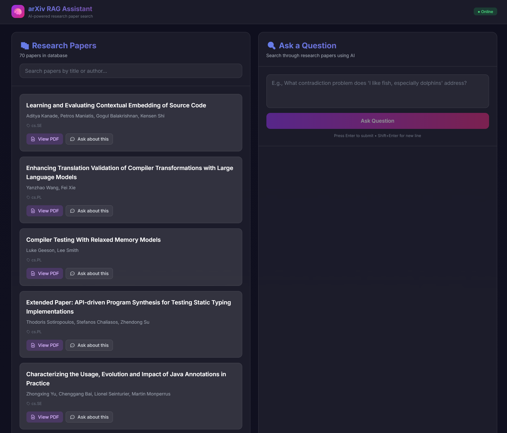
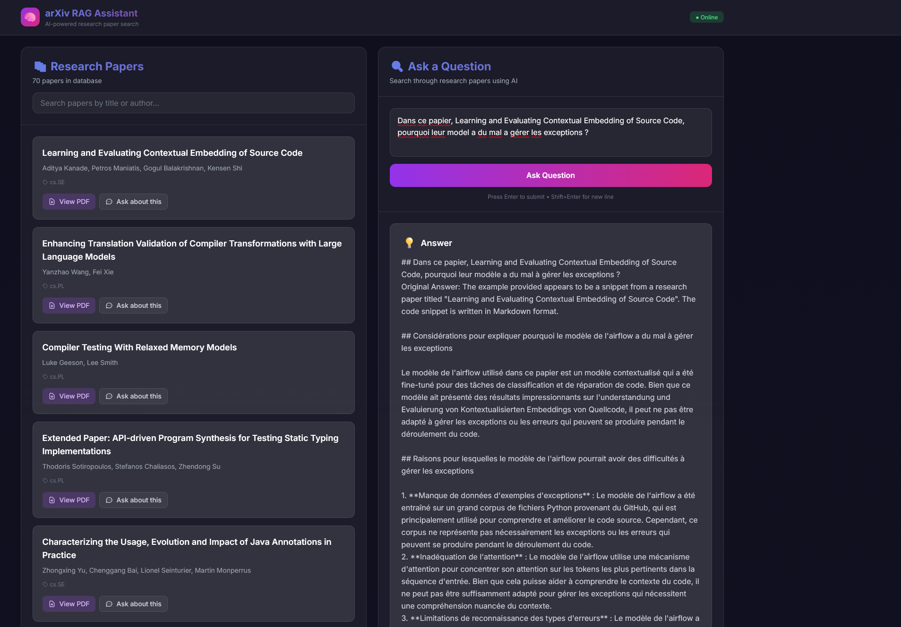

# arXiv RAG Assistant

A RAG-powered research assistant for semantic search and Q&A over arXiv papers. Papers are automatically fetched, chunked with layout awareness, and indexed for intelligent retrieval.

## Stack

- **Frontend**: React, Vite, Tailwind CSS
- **Backend**: FastAPI, LlamaIndex
- **LLM/Embeddings**: Ollama (Mistral, mxbai-embed-large)
- **Vector DB**: OpenSearch
- **Ingestion**: Apache Airflow
- **Database**: PostgreSQL

## Screenshots



## Features

- Layout-aware PDF extraction with PyMuPDF
- Semantic chunking preserving document structure
- Cosine similarity search with HNSW indexing
- Dual-explanation RAG responses (literal + contextual)
- Glassmorphism dark theme UI

## Local Development

**Start all services:**
```bash
docker compose up -d
```

**Access:**
- Frontend: http://localhost:5173
- API: http://localhost:8000
- Airflow: http://localhost:8080 (admin/airflow)

## Project Structure

```
frontend/             # React frontend
  src/
    components/       # RagChat, PaperLists
    App.jsx           # Main layout
src/                  # FastAPI backend
  routers/
    rag.py            # RAG endpoint
    papers.py         # Paper CRUD
airflow/              # Ingestion pipeline
  dags/arxiv_ingestion/
```

## Deployment

```bash
docker compose up -d
# Trigger ingestion in Airflow UI
```

## Environment Variables

Copy `.env.example` to `.env` and configure:
- `OLLAMA_HOST`, `OLLAMA_MODEL`
- `OPENSEARCH_ENDPOINT`, `OPENSEARCH_INDEX`
- `POSTGRES_*` credentials

## License

MIT
